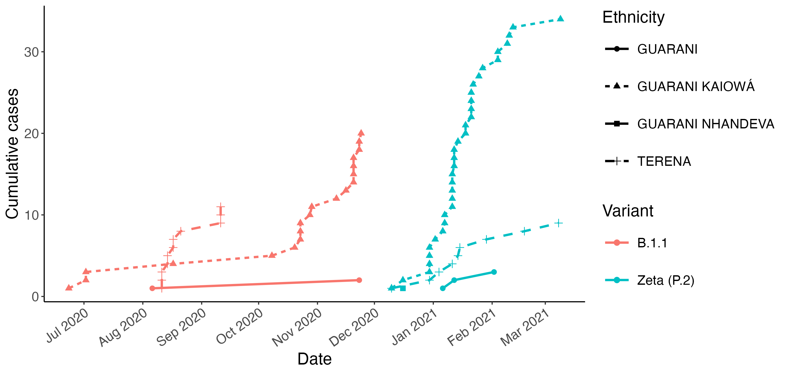
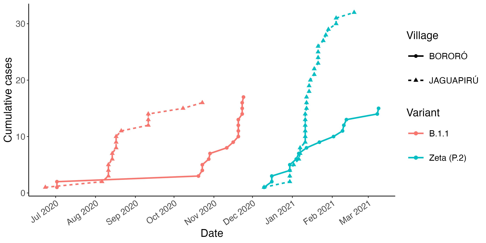

# A first R script to analyze some publicly-available data from Iza, Laís, and Simone's paper.

Instituto Dourados researchers Iza Rezende, Laís Albuquerque, and Simone
Simionatto tracked how different COVID-19 variants spread in an Indigenous
population composed of diverse Indigenous ethnicities, and residing in different
towns, one closer to the neighboring city (Albuquerque, Rezende, ...,
Simionatto, 2023).

Given this new fine-grained perspective on pandemics in Indigenous populations,
the authors could make new hypotheses about what they observed. Right or wrong,
evaluating these hypotheses can support Indigenous public health by contributing
to a growing knowledge base of epidemiological dynamics in Indigenous
populations.

Laís, Iza, and Simone made their data publicly available, and it is included
in the [`data`](/data) directory of this repository. It is in Excel format just
to show the flexibility of the R data analysis ecosystem
[[`data/LaísIzaSimoneEtAl-FrPubHealth2023.xlsx`](/data/LaísIzaSimoneEtAl-FrPubHealth2023.xlsx)].

## Usage:

### In an R shell

```R
source("R/analyze_FrontPubHealth.R")
```

### In a terminal

```
Rscript -e 'source("R/analyze_FrontPubHealth.R")'
```

### The result

The two resulting plots visualize the cumulative number of infections recorded
over time, with separate series for each combination of data dimensions of
variant and ethnicity, and each combination of variant and "village", or
_aldeia_ to use the Brazilian Portuguese term for a village in a _Reserva
Indígena_ in Brazil. One thing we notice, for example, is that in all
dimensional combinations, a large number of cases first spread through
Jaguapiru, and then later through Bororó. This supports the hypothesis that more
frequent travel to the city since Jaguapiru is the aldeia that borders the city
of Dourados.

Two plots are created and written to png by default:
`variant_by_ethnicity_series.pdf` and `variant_by_village_series.pdf`. Both plot
cumulative infections in the Reserva from July 2020 to March 2021.

#### Variant × ethnicity epidemic curves



#### Variant × village epidemic curves



### The data

are publicly available, published to support the following paper:

> **de Oliveira, L. A.**, **de Rezende, I. M.**, Navarini, V. J., Marchioro, S.
> B., Torres, A. J. L., Croda, J., Croda, M. G., Gonçalves, C. C. M., Xavier,
> J., de Castro, E., Lima, M., Iani, F., Adelino, T., Aburjaile, F., Ferraz
> Demarchi, L. H., Taira, D. L., Zardin, M. C. S. U., Fonseca, V., Giovanetti,
> M., … **Simionatto, S.** (2023). Genomic characterization of SARS-CoV-2 from
> an indigenous reserve in Mato Grosso do Sul, Brazil. 
> _Frontiers in Public Health_, 11(October), 1–11. 
> \[[link](https://doi.org/10.3389/fpubh.2023.1195779)\]
